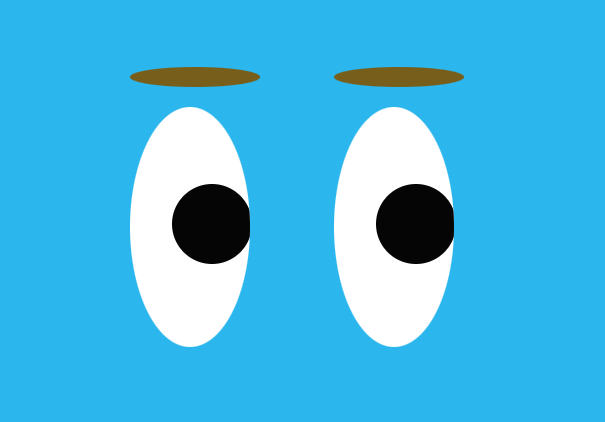

# Eye-Exercise
Eye Exercise: two eyes follow the movement of the mouse pointer

## Description 
This is an exercise of a webpage that shows two eyes. The eye's ball will follow the movement of the mouse pointer. I used JavaScript and CSS to create this webpage. 

## How to Run
Open the html file in any browser

## Roadmap of Future Improvements
Future improvements include:
  - More realistic looking eyes 
  - Movement of the eye brows

## License 
Distributed under the MIT License.

## Contact 
@irene56951729
